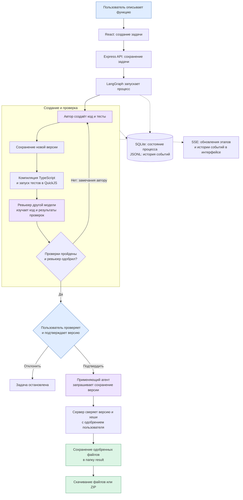

# Контур

Локальное приложение для разработки одной TypeScript-функции. Автор создаёт код, другая модель проверяет его, пользователь подтверждает конкретную версию. Сервер сохраняет одобренные файлы. Интерфейс показывает этапы, события выполнения и замечания ревьюера.

[Как устроена система](docs/system.md) · [Проверки](tests/README.md) · [История решений и материалы сдачи](PROJECT_HISTORY.md)

## Запуск

Нужны Node.js 26+, npm и Codex CLI 0.156.1 по пути `/opt/homebrew/bin/codex`. Для настоящих моделей нужен вход в Codex через ChatGPT, сеть и доступный лимит аккаунта. Путь и версия CLI закреплены в адаптере; интерфейса авторизации в приложении нет.

```sh
npm ci
/opt/homebrew/bin/codex login status
# Если входа нет:
/opt/homebrew/bin/codex login
npm start
```

Откройте <http://127.0.0.1:4317>. `npm start` собирает интерфейс и запускает сервер.

Сначала проверьте панель «Подключение к Codex». Если вход отсутствует, выполните `codex login` в терминале на компьютере сервера и нажмите «Проверить снова». До успешной локальной проверки запуск заблокирован. Доступ к облачным моделям и лимит аккаунта проверяются при фактическом запросе.

1. Опишите функцию или выберите пример и запустите задачу.
2. Просмотрите созданную версию, проверки и замечания.
3. Подтвердите или отклоните показанную версию.
4. После применения скачайте файлы или `kontur-result.zip`.

Для запуска без облачных вызовов:

```sh
APP_CODEX_MODE=mock APP_MOCK_SCENARIO=review_once APP_DATA_DIR=.local-data/mock npm start
```

В `review_once` первая версия замокана с намеренной ошибкой; ревью и исправление тоже заданы адаптером. Режим показан в интерфейсе. Все mock-сценарии описаны в [инструкции проверок](tests/README.md).

## Поток работы



Лимит вызовов или версий останавливает задачу. Неизвестный исход вызова ставит её на паузу до явного повтора. После перезапуска сервер восстанавливает сохранённое состояние.

## Настройки

| Переменная | По умолчанию | Назначение |
| --- | --- | --- |
| `APP_PORT` | `4317` | HTTP-порт на `127.0.0.1`. |
| `APP_DATA_DIR` | `.local-data` | Папка задач, состояния и логов. |
| `APP_CODEX_MODE` | `real` | Настоящий Codex или `mock`. |
| `APP_MOCK_SCENARIO` | `happy` | Сценарий mock-ответов. |
| `AUTHOR_MODEL` | `gpt-6-sol` | Модель автора. |
| `REVIEWER_MODEL` | `gpt-6-luna` | Модель ревьюера. |
| `APPLIER_MODEL` | `gpt-6-sol` | Модель применяющего агента. |

Поддерживаются `gpt-6-sol` и `gpt-6-luna`; автор и ревьюер должны использовать разные модели. Неподдерживаемое значение отклоняется при запуске. Настройки читаются из окружения процесса.

## Данные

```text
.local-data/
  tasks-index.json
  checkpoints.sqlite
  .owner-lock.sqlite
  server-events.jsonl
  tasks/<task-id>/
    revisions/<version-id>/
    result/
    events.jsonl
```

Индекс хранит список задач, SQLite — состояние выполнения, `events.jsonl` — события задачи. В `revisions/` лежат версии кода и тестов, в `result/` — одобренные файлы. Для переноса остановите сервер и перенесите всю папку данных, включая скрытые файлы.

`server-events.jsonl` — технические логи во время работы сервера: запуск, шаги, результаты проверок и типы ошибок. Записи дублируются в терминале. Тексты заданий, код и полные ответы моделей в журнал не попадают. При достижении примерно 5 МБ файл переносится в `server-events.jsonl.1`; сохраняется один предыдущий файл.

Закрытие вкладки оставляет сервер работающим. `Ctrl+C` завершает его; повторный запуск с той же папкой данных открывает сохранённые задачи. Для второго сервера нужны другая папка и порт:

```sh
APP_DATA_DIR=.local-data/another-run APP_PORT=4318 npm start
```

## Ограничения

- Одна активная задача; максимум 3 версии, 7 вызовов модели, 180 секунд на вызов.
- Чистая синхронная TypeScript-функция с JSON-входами и выходом, без сети, файлов и зависимостей.
- Проверки выполняются в QuickJS; успешные тесты и ревью не доказывают корректность для любых входов.
- Запуск проверен на macOS с указанным CLI. Настройка пути CLI и вход через интерфейс не реализованы.

## Проверки и разработка

```sh
npm run check
```

Команда запускает ESLint, TypeScript, unit/integration-тесты и сборку. Браузерные и модельные прогоны запускаются отдельно: [tests/README.md](tests/README.md).

Правила изменений: [AGENTS.md](AGENTS.md), [процесс работы](development-process.md).
